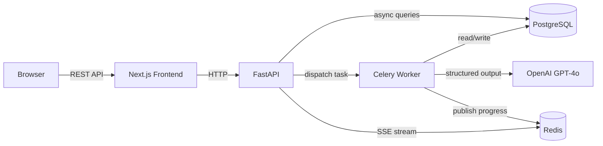

# DocPilot

**AI-powered contract review and extraction platform.**


[](https://nextjs.org/)
[](https://fastapi.tiangolo.com/)
[](https://www.postgresql.org/)
[](https://redis.io/)
[](https://docs.celeryq.dev/)
[](https://openai.com/)
[](https://docs.docker.com/compose/)
[](https://www.typescriptlang.org/)
[](https://github.com/your-username/docpilot/actions)
[](LICENSE)

## What It Does

Upload PDF contracts (NDAs, service agreements, employment contracts) and DocPilot automatically classifies the document type, extracts key fields like parties, dates, and payment terms using GPT-4o, and flags risky clauses with plain-English explanations. Compare two contracts side-by-side to spot differences at a glance.

## Key Features

- **AI-Powered Extraction** — Classifies document type and extracts structured fields using GPT-4o with JSON mode and Pydantic validation
- **Risk Analysis** — Identifies risky clauses (non-compete, liability, termination) with risk levels and plain-English explanations
- **Contract Comparison** — Side-by-side field-level diff between any two contracts with match/difference/missing indicators
- **Real-Time Progress** — Server-Sent Events stream processing updates to the browser as each pipeline step completes
- **Team Workspaces** — Multi-tenant architecture with role-based access (owner, admin, member) and team invitations
- **Async Pipeline** — Celery workers process documents in the background so the API stays responsive

## Architecture



## Tech Stack

| Layer | Technology |
|-------|-----------|
| **Frontend** | Next.js 15, TypeScript, Tailwind CSS, shadcn/ui |
| **Backend** | Python 3.12, FastAPI, SQLAlchemy (async), Alembic |
| **AI** | OpenAI GPT-4o, structured JSON output, Pydantic validation |
| **Queue** | Celery, Redis |
| **Database** | PostgreSQL 16 |
| **DevOps** | Docker Compose, GitHub Actions CI |

## Getting Started

### Prerequisites

- [Docker](https://docs.docker.com/get-docker/) and Docker Compose
- [Node.js 20+](https://nodejs.org/) (for frontend development)
- An [OpenAI API key](https://platform.openai.com/api-keys)

### Setup

```bash
# Clone the repo
git clone https://github.com/your-username/docpilot.git
cd docpilot

# Copy env file and add your OpenAI API key
cp .env.example .env
# Edit .env and set OPENAI_API_KEY=sk-your-key-here

# Start the backend services (API + worker + Postgres + Redis)
docker compose up -d

# Run database migrations
docker compose run --rm api alembic upgrade head

# Install frontend dependencies and start the dev server
cd apps/web
npm install
npm run dev
```

Open [http://localhost:3000](http://localhost:3000) and create an account to get started.

> **Note:** The API runs on port 8001 by default. Swagger docs are available at [http://localhost:8001/docs](http://localhost:8001/docs).

## Project Structure

```
docpilot/
├── apps/
│   ├── api/                    # FastAPI backend
│   │   ├── app/
│   │   │   ├── main.py         # App entry point + CORS
│   │   │   ├── config.py       # Pydantic Settings (env vars)
│   │   │   ├── database.py     # Async SQLAlchemy engine
│   │   │   ├── models/         # ORM models (User, Document, Extraction, ...)
│   │   │   ├── schemas/        # Pydantic request/response schemas
│   │   │   ├── routers/        # API endpoints (auth, documents, compare, teams)
│   │   │   ├── services/       # Business logic (extraction pipeline, compare)
│   │   │   ├── tasks/          # Celery background tasks
│   │   │   ├── prompts/        # LLM prompt templates per doc type
│   │   │   └── utils/          # PDF parser, text chunker, LLM client
│   │   ├── alembic/            # Database migrations
│   │   ├── Dockerfile
│   │   └── requirements.txt
│   │
│   └── web/                    # Next.js frontend
│       ├── src/
│       │   ├── app/            # App Router pages
│       │   ├── components/     # UI components (shadcn + custom)
│       │   ├── hooks/          # React hooks (SSE, documents, auth)
│       │   ├── lib/            # API client, auth utils
│       │   └── types/          # TypeScript interfaces
│       ├── Dockerfile
│       └── package.json
│
├── docker-compose.yml          # Local dev (with hot reload)
├── docker-compose.prod.yml     # Production
├── .github/workflows/ci.yml    # CI pipeline
└── .env.example                # Environment variables template
```

## API Documentation

With the backend running, interactive API docs are available at:

- **Swagger UI:** [http://localhost:8001/docs](http://localhost:8001/docs)
- **ReDoc:** [http://localhost:8001/redoc](http://localhost:8001/redoc)

## License

[MIT](LICENSE)
